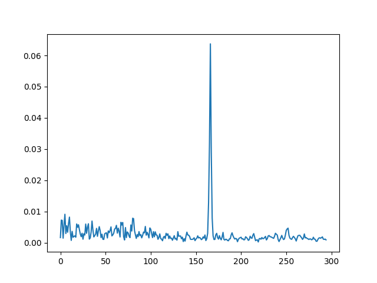
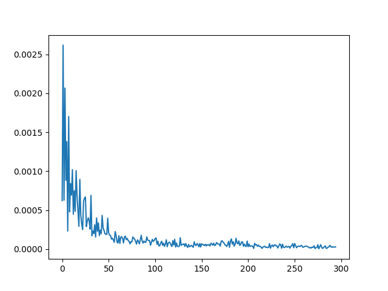

# Mutual-Information-Profile
### Daniel Villegas Aguilar            DanVillAg
## Introducción:

El objetivo de este proyecto es replicar algunos de los resultados expuestos en el artículo "The Average Mutual Information Profile as a Genomic Signature" de Mark Bauer, Sheldon M Schuster y Khalid Sayood. En particular es de nuestro interes el trabajar los métodos referentes a técnicas de Teoría de la ingormación para el análisis de secuencias genómicas.

Dentro del trabajo los autores exponen la idea de los perfiles EMI, un perfilamiento de secuencias por medio de la [Información Mutua](https://es.wikipedia.org/wiki/Informaci%C3%B3n_mutua) otorgada entre dos bases/nucleótidos que se encuentren a una separación k dentro de la secuencia. Los autores muestran como el hacer una estimación de esta métrica variando el valor de k nos proporciona con una especie de "firma genómica" que tiene propiedades intereantes.

La existencia de patrones que pueden ser utilizados como una firma de los datos son indicativos de estructuras estadísticas o deterministas en los datos. En las secuencias de ADN esta estructura puede deberse a procesos biológicos que involucran el ADN o pueden aparecen debido a eventos y procesos en la evolución- Historia del ADN.

Los perfiles AMI se pueden detectar en pequeños fragmentos de la secuencia de ADN. La firma genómica propuesta es una vector donde la késima entrada es la AMI entre nucleótidos que estan k ubicaciones separados. Los perfiles AMI se generan libremente de cualquier parámetro que resulta en un cálculo automatizado e imparcial.

Estos resultados indican que en algún nivel el perfil AMI puede ser visto como una representación de la historia evolutiva del organismo. Como el perfil AMI es una medida promediada  la estructura evidenciada por el perfil es probable que sea prevalente en otras secuencias del organismo. Es decir, esta historia debería verse reflejada hasta cierto punto en todas las partes del genoma y los fragmentos suficientemente largos del genoma debrían tener perfiles similares Los organismos que están relacionados evolutivamente tienen una extensa historia común. Si el perfil AMI refleja la evolución histórica, esta historia común debe reflejarse en la similitud de sus perfiles AMI.

El calculo de la Información Mutua se realiza:

Donde la probabilidad de que dos bases aparezcan k-separadas en una secuencia está dado por el conteo de apariciones N_k(X,Y):

## Objetivo:

Replicar los resultados de los experimentos referentes a técnicas de Teoría de la Información presentados en "The Average Mutual Information Profile as a Genomic Signature".

## Diagrama Metodológico:

1. Revisión de la literatura.
2. Descarga y consulta de varias de las secuencias utilizadas:
   * [Mus musculus](https://www.ncbi.nlm.nih.gov/genome?term=txid10091%5BOrganism%3Anoexp%5D&cmd=DetailsSearch)
   * [Caenorhabditis elegans](https://www.ncbi.nlm.nih.gov/genome?term=ins-1%5Bc%20elegance%5D&cmd=DetailsSearch)
   * [Homo sapiens (human)](https://www.ncbi.nlm.nih.gov/genome?term=human&cmd=DetailsSearch)
   * [Saccharomyces cerevisiae](https://www.ncbi.nlm.nih.gov/genome/?term=Saccharomyces%20cerevisiae[Organism]&cmd=DetailsSearch)
4. Desarrollo de un primer [intento](proyecto/archive/InfoMutua.py) :( de calcular la información mutua que no resultó muy exitoso.
6. Desarrollo de un segundo módulo de anális de la información con apoyo del profesor. Para el desarrollo de ambos módulos se utilizó:
   * [Python 3.10.1](https://www.python.org/)
   * [NumPy 1.22.0](https://numpy.org/)
   * [scikit-learn 1.0.2](https://scikit-learn.org/stable/index.html)
   * [Biopython 1.79](https://biopython.org/)
   * [Seaborn 0.11.2](https://seaborn.pydata.org/)
   * [Matplotlib 3.5.0](https://matplotlib.org/)
8. Desarrollo de un módulo de lectura de archivos FASTA para la interpretación de secuencias.
9. Extensión del módulo de información mutua para agregar funcionaliad adicional como la capacidad de graficar y realizar el cálculo de correlaciones.
10. Experimentación.
11. Recopilación de resultados y gráficos.

## Resultados:

Lorem ipsum

Lorem ipsum

Lorem ipsum

Lorem ipsum

Lorem ipsum

Lorem ipsum

Lorem ipsum

## Conclusiones:

Lorem ipsum

## Referencias:

Lorem ipsum
1. Newcomb, Garin P., "Genome Annotation Using Average Mutual Information" (2021). Theses,Dissertations, and Student Research from Electrical & Computer ngineering. 127.https://digitalcommons.unl.edu/elecengtheses/127
2. Bauer M, Schuster SM, Sayood K. The average mutual information profile as a genomic signature. BMC Bioinformatics. 2008 Jan 25;9:48. doi: 10.1186/1471-2105-9-48. PMID: 18218139; PMCID: PMC2335307.
